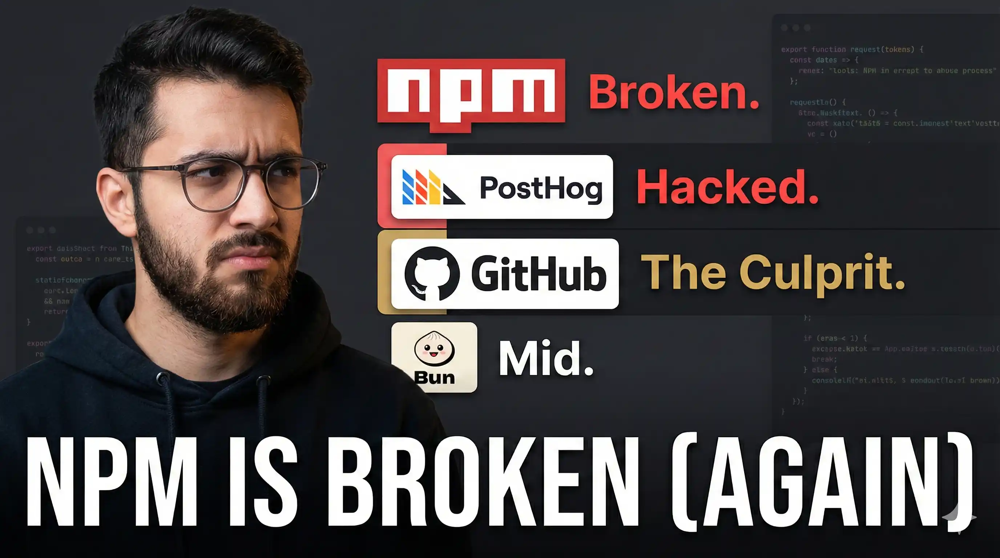
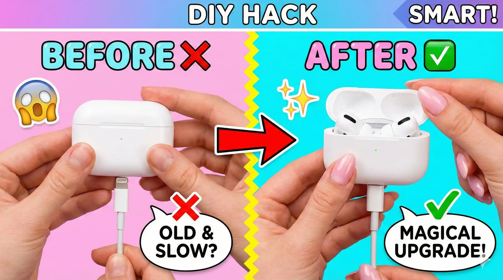
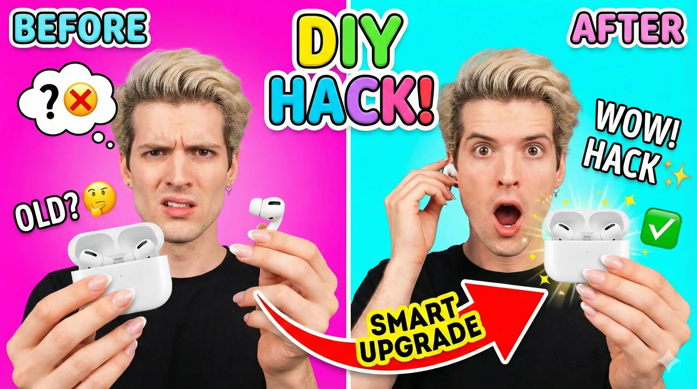
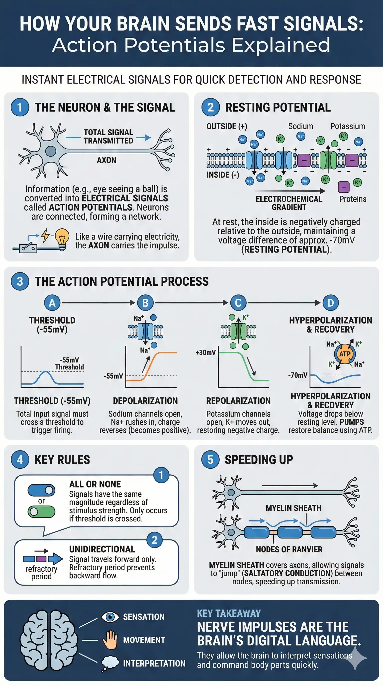
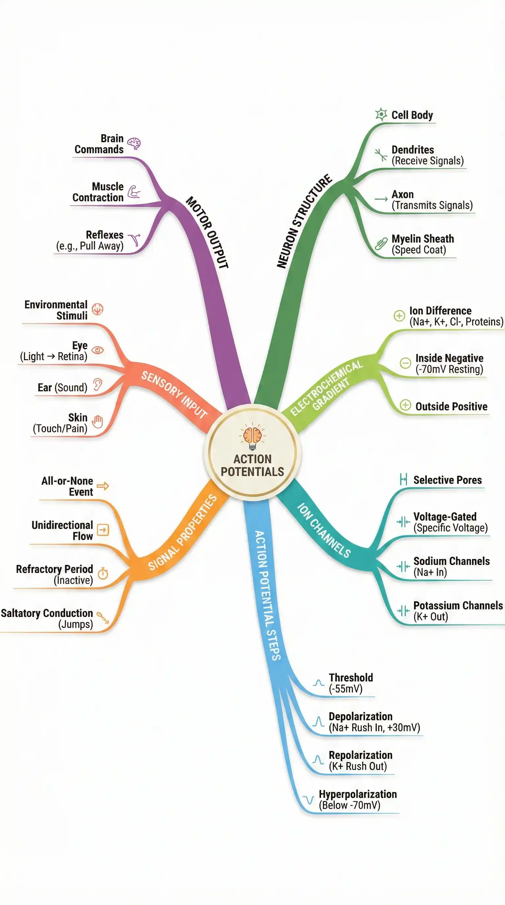
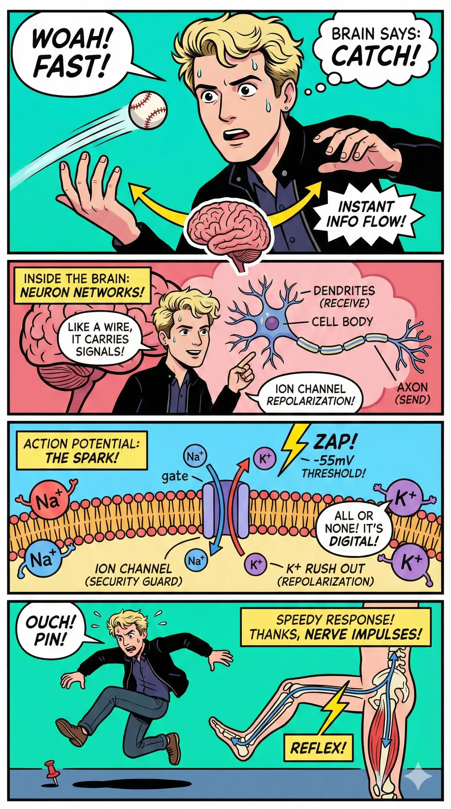
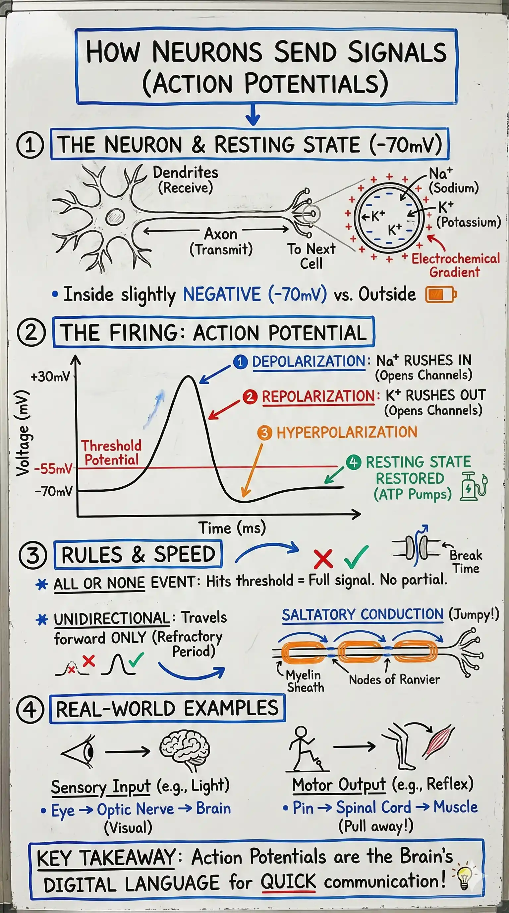
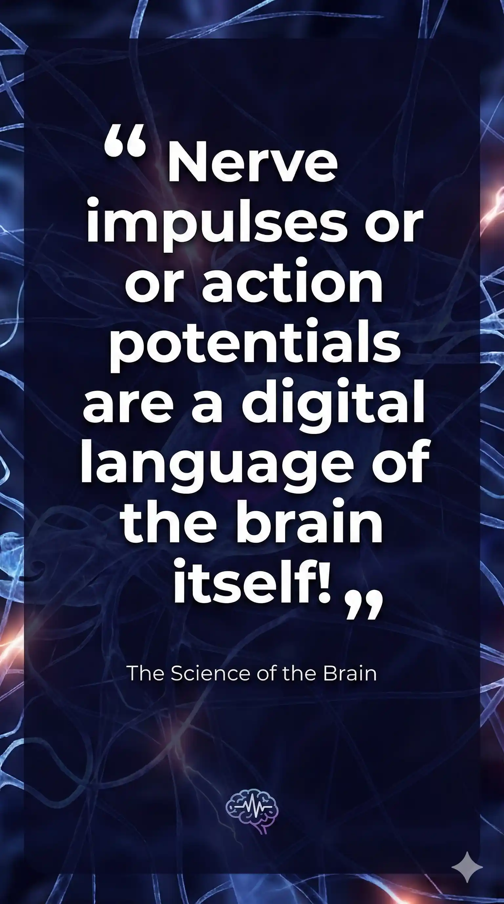

# CapSummarize — AI-powered Video Caption Summaries

CapSummarize is a free, open-source browser extension that extracts video captions and helps you generate AI summaries, thumbnails, and short video clips using your favorite AI providers (ChatGPT, Claude, Gemini, Grok, and more).

[](https://chromewebstore.google.com/detail/lbhdfoediecbmfenldcegamiideipkig?utm_source=item-share-cb)

## ✨ Features

- **Extract captions** from YouTube, Google Drive, Udemy, Zoom, and more
- **Multiple summary styles** - Choose from 15+ different formats (Default, Educational, Technical, Podcast, Kids-friendly, etc.)
- **🎨 AI Image Generation** - Analyze transcript to create thumbnails, infographics, mind maps, and more
- **🎬 AI Video Generation** - Analyze transcript to generate video clips (Gemini only)
- **Use any AI provider** - ChatGPT, Claude, Gemini, Grok, Perplexity, Mistral, Meta AI, and more
- **Custom variants** - Create your own summary templates
- **History tracking** - Access previously captured transcripts
- **Privacy-focused** - All processing happens locally, no data sent to external servers
- **100% Free** - No subscriptions, no limits

---

## 📸 Examples Gallery

See what CapSummarize can generate! All examples below were created from real YouTube videos.

### 🎨 AI-Generated Thumbnails

| Style                   | Without Reference                                            | With Reference                                                                 |
| ----------------------- | ------------------------------------------------------------ | ------------------------------------------------------------------------------ |
| **MrBeast Style**       |     |     |
| **Casey Neistat Style** |  |  |
| **Theo/Tech Style**     |            |            |
| **5-Min Crafts Style**  |   |   |
| **General Thumbnail**   |      |      |

### 🖼️ Other Image Styles

| Infographic                                                      | Mind Map                                                   | Comic Strip                                          |
| ---------------------------------------------------------------- | ---------------------------------------------------------- | ---------------------------------------------------- |
|  |  |  |

| Whiteboard                                                     | Quote Card                                                     | Scene                                                |
| -------------------------------------------------------------- | -------------------------------------------------------------- | ---------------------------------------------------- |
|  |  |  |

### 📝 Text Summary Examples

| Style           | Description                              | Example                                   |
| --------------- | ---------------------------------------- | ----------------------------------------- |
| **Default**     | Balanced, comprehensive summary          | [View](examples/summaries/default.md)     |
| **Educational** | Academic-focused with key concepts       | [View](examples/summaries/educational.md) |
| **Technical**   | Code-focused with implementation details | [View](examples/summaries/technical.md)   |
| **Casual**      | Friendly, conversational tone            | [View](examples/summaries/casual.md)      |
| **Executive**   | Business-focused brief                   | [View](examples/summaries/executive.md)   |
| **Blog**        | SEO-optimized blog post                  | [View](examples/summaries/blog.md)        |
| **X/Twitter**   | Thread-ready format                      | [View](examples/summaries/twitter.md)     |
| **Cheatsheet**  | Quick reference card                     | [View](examples/summaries/cheatsheet.md)  |
| **Kids**        | Simple language for ages 7-12            | [View](examples/summaries/kids.md)        |

[View all summary examples →](examples/summaries/)

---

## 🚀 Quick Start

### Install from Source

1. **Clone the repository**

   ```bash
   git clone https://github.com/samuxbuilds/capsummarize.git
   cd capsummarize/capsummarize-frontend
   ```

2. **Install dependencies** (using [Bun](https://bun.sh) recommended)

   ```bash
   bun install
   # or
   npm install
   ```

3. **Build the extension**

   ```bash
   bun run build
   # or
   npm run build
   ```

4. **Load in Chrome**
   - Open `chrome://extensions/`
   - Enable **Developer mode** (top-right)
   - Click **Load unpacked** and select the `dist/` folder

## 🔧 Development

Start the development server with hot reload:

```bash
bun run dev
# or
npm run dev
```

This watches for file changes and rebuilds automatically.

### Available Scripts

| Command              | Description                       |
| -------------------- | --------------------------------- |
| `npm run dev`        | Start development mode with watch |
| `npm run build`      | Build for production              |
| `npm run lint`       | Run ESLint                        |
| `npm run format`     | Format code with Prettier         |
| `npm run type-check` | Run TypeScript type checking      |
| `npm run clean`      | Remove build artifacts            |

## 📁 Project Structure

```
src/
├── background/          # Service worker modules
│   ├── messageHandlers.ts
│   ├── sidePanelManager.ts
│   ├── storageHelpers.ts
│   └── vttCacheManager.ts
├── config/              # Configuration
│   ├── prompts.ts       # Summary prompt templates
│   └── providers.ts     # AI provider definitions
├── services/            # Business logic
│   └── providerService.ts
├── types/               # TypeScript type definitions
├── ui/                  # User interface
│   ├── components/      # Reusable UI components
│   ├── state/           # State management
│   ├── sidepanel.ts     # Main side panel
│   └── settings.ts      # Settings page
├── utils/               # Utility functions
│   ├── storage.ts       # IndexedDB wrapper
│   ├── vtt.ts           # VTT parsing
│   └── ...
├── background.ts        # Service worker entry
├── content.ts           # Content script
├── interceptor.ts       # Caption interception
└── manifest.ts          # Extension manifest generator
```

## 🎨 Summary Styles

CapSummarize includes 15 built-in summary styles:

- **Default** - Balanced, comprehensive summary
- **Educational** - Academic-focused with key concepts
- **Technical** - Code-focused with implementation details
- **Casual** - Friendly, conversational tone
- **Executive** - Business-focused brief
- **Marketing** - Engaging promotional style
- **News** - Journalistic article format
- **Podcast** - Audio-friendly notes
- **Kids** - Simple language for young audiences
- **Blog** - SEO-optimized blog post
- **YouTube** - Video description format
- **Cheatsheet** - Quick reference card
- **Recap** - Brief highlights
- **Interview** - Q&A format
- **X/Twitter** - Thread-ready format

You can also create custom variants in Settings.

## 🎨 Image Generation Styles

Generate AI images by analyzing your video transcript (requires ChatGPT, Gemini, or Grok):

- **Thumbnail (General)** - Eye-catching YouTube thumbnails
- **Thumbnail (MrBeast)** - Explosive, bright colors, high energy
- **Thumbnail (Casey Neistat)** - Cinematic, documentary feel
- **Thumbnail (Theo)** - Tech-focused, clean modern design
- **Thumbnail (5-Min Crafts)** - DIY aesthetic, step-by-step
- **Thumbnail (Linus Tech)** - Tech review, product-focused
- **Infographic** - Visual data representation
- **Comic Strip** - Comic-style visual story
- **Mind Map** - Organic tree-style concept map
- **Whiteboard** - Hand-drawn diagram aesthetic
- **Quote Card** - Shareable quote with key insight
- **Scene** - Key moment visualization

## 🎬 Video Generation Styles

Generate AI video clips by analyzing your transcript (Gemini only):

- **Advertisement** - Short promotional ad clip
- **Trailer** - Cinematic teaser trailer
- **Quick Recap** - Fast-paced summary clip
- **Explainer** - Educational explainer clip
- **Cinematic** - Artistic cinematic sequence
- **Social Media** - Viral social media clip

## 🔒 Privacy & Security

- **No external servers** - Everything runs locally in your browser
- **No data collection** - Your video content never leaves your device
- **No accounts required** - Use immediately without signup
- **Open source** - Audit the code yourself

See [PRIVACY_POLICY.md](PRIVACY_POLICY.md) and [SECURITY_PRACTICES.md](SECURITY_PRACTICES.md) for details.

## 🌐 Supported Sites

- YouTube
- Google Drive
- Google Sites
- Udemy
- Zoom
- X (Twitter)
- And more via caption interception

## 🤝 Contributing

We welcome contributions! Please see [CONTRIBUTING.md](CONTRIBUTING.md) for guidelines.

1. Fork the repository
2. Create a feature branch (`git checkout -b feature/amazing-feature`)
3. Make your changes
4. Run lint and type checks (`npm run lint && npm run type-check`)
5. Commit your changes (`git commit -m 'Add amazing feature'`)
6. Push to the branch (`git push origin feature/amazing-feature`)
7. Open a Pull Request

## 📄 License

This project is licensed under the MIT License - see the [LICENSE](LICENSE) file for details.

## 🙏 Acknowledgments

- Built with TypeScript, Tailwind CSS, and Bun
- Icons from various AI providers

## 🌐 Connect

- [Follow on X (Twitter)](https://x.com/samuxbuilds)

---

Made with ❤️ by [SamuxBuilds](https://x.com/samuxbuilds) and the CapSummarize community
