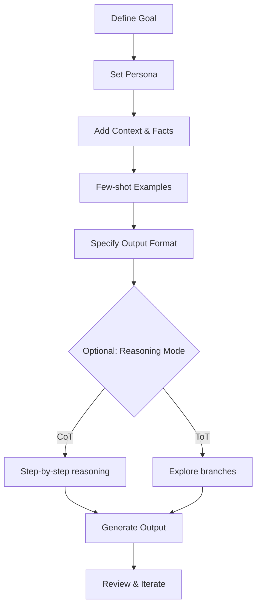

# You SUCK at Prompting AI (Here's the secret)

**Source:** [You SUCK at Prompting AI (Here's the secret)](https://www.youtube.com/watch?v=pwWBcsxEoLk)
**Style:** Blog
**Provider:** ChatGPT
**Generated:** 2025-12-02

---

# The Ultimate Prompting Guide: Master Prompt Engineering

## Introduction (Hook + Context)

Have you ever screamed at ChatGPT because it gave you garbage when you just needed one clear answer? You’re not alone — frustration with AI results is a universal rite of passage for anyone using large language models. But before you toss the laptop or swear off AI, know this: the problem is almost always clarity, not the model.

Prompting isn’t just asking questions — it’s programming with words. When you prompt well, you’re crafting a small program the model will execute. The transcript behind this article (from a practical 2025 walkthrough) unpacks core prompting techniques, shows how experts think about prompts, and teaches you how to stop blaming the AI and start getting reliably useful outputs.

Read on and you’ll learn the foundational mindset (LLMs = prediction engines), practical techniques (personas, context, few-shot, chain-of-thought, Trees-of-Thought, adversarial validation), and one meta-skill that ties it all together: clarity of thought. The examples below include ready-to-use prompt templates and API-style snippets you can drop into a chat or a system prompt.

This guide distills lessons from prompting researchers and practitioners — Dr. Jules White, Anthropic docs, Coursera prompting courses, and senior prompt engineers like Daniel Mesler, Joseph Thacker, and Eric Pope — so you get both theory and practical, repeatable patterns to use today.

---

## Quick Takeaways (TL;DR)

* ✅ Prompting is programming — treat prompts as small programs that shape model behavior.
* ✅ Use personas to narrow the model’s perspective and improve voice and accuracy.
* ✅ Provide explicit context (facts, timeline, constraints) to reduce hallucinations.
* ✅ Few-shot examples teach the model the pattern you want it to follow.
* ✅ Chain-of-thought and Trees-of-Thought improve reasoning and generate better options.
* ✅ The meta-skill: sharpen your own thinking first — clarity produces better prompts.

---

## Section 1 — The Mindset: LLMs Are Prediction Engines

Start with one mental model: LLMs do statistical completion, not reasoning like a human. That matters because vague prompts let the model “guess” what you want, and guessing creates hallucinations and fluff.

When you adopt the “prompt-as-program” mindset, you stop asking and start instructing. You define the persona, give explicit facts, set output formats, and show examples when necessary. This transforms the model from “some helpful stranger” into a repeatable process executor.

Be concrete about what you expect the model to use and what it should never invent. If a model can access tools (web, memory, code execution), tell it to use them; if it cannot, instruct it to say “I don’t know” rather than fabricating facts.

### H3 — Example: Basic persona vs. no persona

(Personas narrow the model’s knowledge source and voice.)

---

## Section 2 — Core Techniques: Personas, Context, and Output Spec

Three primitives drive most improvements: (1) persona, (2) context, (3) output requirements.

Persona — tell the model *who* is speaking (e.g., “Senior SRE at Cloudflare writing to customers and engineers”). This locks voice, ownership (“I” vs “we”), and domain assumptions.

Context — give facts, timelines, and constraints. If the model doesn’t know a real event (frozen training), include the relevant facts. Don’t be stingy: whatever you omit, the model will fill in — often wrongly.

Output Spec — require length limits, tone, structure, and format. Examples are powerful: show one or two exemplar emails and the model will mirror structure and phrasing (few-shot prompting).

### H3 — Mini workflow you can copy

1. Set persona (system or first-line user).
2. Provide full context facts (bullet list).
3. Show 1–2 examples of desired output.
4. Request output with exact format and constraints.

---

## Section 3 — Advanced Techniques: Chain-of-Thought, Trees-of-Thought, and Playoffs

If you want better reasoning, ask the model to show its work.

Chain-of-Thought (CoT) prompts instruct the LLM to think step-by-step before answering. This often improves accuracy and transparency. Vendors sometimes bake this in as “extended thinking” or “reasoning” modes.

Trees-of-Thought (ToT) expands CoT by exploring multiple reasoning branches in parallel and picking the best. It’s great for complex decisions or creative strategy where the first idea isn’t necessarily the best.

Playoff / Battle-of-the-Bots uses competing personas to generate drafts, then asks a critic persona to evaluate, and finally synthesizes the best elements. This taps the model’s strength in editing and critique.

### H3 — Why these help

They reduce overconfident hallucination by forcing internal evaluation, and they create diverse candidate answers to be filtered and combined.

---

## Code Examples — Practical Prompting Snippets (Context + Code + Explanation + Use Case)

> Note: These are *prompt* code examples you can paste into chat UIs or into API `system`/`user` prompts. Use them as templates.

### Example 1 — System + User Prompt (Persona + Context)

**Context:** Use when you control the system prompt (API or platform that supports system messages).

```json
{
  "system": "You are a Senior Site Reliability Engineer at Cloudflare. Write clear, concise incident emails for technical and customer audiences. Avoid speculation; if facts are unknown, say 'I don't know'.",
  "user": "We had a service outage at 2025-11-30 14:20 UTC affecting DNS resolution for 20% of customers. Duration: 45 minutes. Root cause under investigation. Produce a 150-200 word apology email with timeline, ownership, and next steps."
}
```

**Explanation:** Separates persona (system) from task (user). Forces model to speak as an SRE and to admit uncertainty.
**Use Case:** Generating incident communications from internal facts.

### Example 2 — Few-Shot Prompt (Show, Don't Tell)

**Context:** Use when you want the model to adopt a particular tone and structure by example.

```text
Example 1:
Subject: Incident — DNS outage (Nov 30)
Body: We experienced a DNS disruption affecting ~20% of users from 14:20–15:05 UTC. We own this. Steps taken: A, B, C. Next steps: X, Y. Contact: sre-team@example.com.

Now write a new email for the outage on 2025-12-01 09:10 UTC affecting API latency for 12% of customers. Keep under 180 words, tone: apologetic but factual.
```

**Explanation:** Shows the model what you want; few-shot reduces ambiguity.
**Use Case:** Customer-facing templates and repetitive messaging.

### Example 3 — Chain-of-Thought Instruction

**Context:** Use for analytical outputs or when reasoning is important.

```text
Instruction: Before writing the email, list 4 steps you will take to decide what to include. Then produce the email. If any fact is missing, explicitly say 'Fact missing: [what]'.
```

**Explanation:** Forces internal planning and transparency; helps avoid hallucinations.
**Use Case:** Complex incident reports, postmortems, or decision memos.

### Example 4 — Playoff / Battle of the Bots (Adversarial Validation)

**Context:** Use when you want competing drafts and a merged final output.

```text
Round 1: Persona A (SRE) -> Write draft A.
Round 1: Persona B (PR Manager) -> Write draft B.
Round 2: Persona C (Angry Customer) -> Critique A and B.
Round 3: Personas A+B -> Synthesize final email using critique notes. Keep final under 200 words.
```

**Explanation:** Generates diversity, leverages critique to improve final output.
**Use Case:** High-stakes communications where you want robustness and empathy.

---

## Mermaid Diagram — High-level Prompt Flow



---

## Common Mistakes to Avoid

* ❌ **Mistake**: Vague persona or no persona.

  * Why it's wrong: Model defaults to generic, soulless outputs.
  * What to do instead: Specify role, audience, and desired voice.

* ❌ **Mistake**: Skimping on context.

  * Why it's wrong: Missing facts get filled with hallucinations.
  * What to do instead: Provide concise bullet facts and constraints.

* ❌ **Mistake**: No output requirements (length, tone, structure).

  * Why it's wrong: Outputs become too long, unfocused, or inconsistent.
  * What to do instead: State exact format, word limit, and tone.

* ❌ **Mistake**: Assuming the model “remembers” everything.

  * Why it's wrong: Memory/features vary and can be incomplete.
  * What to do instead: Always re-provide critical context in each session.

* ❌ **Mistake**: Expecting model to admit ignorance without instruction.

  * Why it's wrong: Models prefer to answer and may fabricate.
  * What to do instead: Instruct the model to say “I don’t know” when facts missing.

---

## Expert Tips / Advanced Insights

* 💡 **Tip**: Treat prompting like spec-writing.

  * Explanation: The clearer your spec, the less the model guesses. Spend 5–10 minutes writing the spec before prompting.

* 💡 **Tip**: Use few-shot examples that are *minimal but representative*.

  * Explanation: Full-length examples can confuse; short, focused examples teach structure cleanly.

* 💡 **Tip**: Combine CoT with safety checks.

  * Explanation: Ask the model to list assumptions and cite sources or state if none exist.

* 💡 **Tip**: Save high-performing prompts to a prompt library.

  * Explanation: Reuse and version your prompts just like code — it prevents regressions.

* 💡 **Tip**: Use the "battle" method for creative or critical tasks.

  * Explanation: Competing drafts force higher-quality synthesis by leveraging the model’s editing strengths.

* 💡 **Tip**: When using web/tools, constrain sources.

  * Explanation: Tell the model which domains or date ranges to prioritize to avoid stale or low-quality info.

* 💡 **Tip**: Red-team your prompt before using it in production.

  * Explanation: Try to break it with adversarial inputs — if it survives, it’s more robust.

---

## Key Takeaways

* ✅ **Takeaway 1**: Prompting equals programming — design prompts like small programs.
* ✅ **Takeaway 2**: Personas narrow output and improve voice and ownership.
* ✅ **Takeaway 3**: Full context is the antidote to hallucination.
* ✅ **Takeaway 4**: Few-shot examples show the exact pattern you want.
* ✅ **Takeaway 5**: Chain-of-Thought and Trees-of-Thought boost reasoning and option diversity.
* ✅ **Takeaway 6**: The playoff method exploits the model’s critique strength to improve quality.
* ✅ **Takeaway 7**: The most important meta-skill is clarity of thought — sharpen your own thinking first.

---

## Conclusion

Prompting well is less about tricking an AI and more about sharpening how you express problems. When you treat prompts as programs — defining persona, feeding precise context, showing examples, and specifying outputs — you dramatically reduce guesswork and hallucinations.

Advanced techniques like chain-of-thought, trees-of-thought, and adversarial playoffs give you stronger, more trustworthy outputs, especially for complex or high-stakes tasks. But none of these work unless your thinking is clear first. The AI can only be as clear as the instructions you give it.

So before you curse the model next time, pause. Sketch the workflow, bullet the facts, pick the persona, and then prompt. Save your winning prompts into a library and iterate. Do that and you’ll stop having “skill issues” — you’ll be designing systems that reliably scale your thinking.

Want help converting one of your own prompts into a production-ready prompt library entry? Paste a prompt and the context here — I’ll refactor it into a system + user template, few-shot examples, and a testing checklist.
